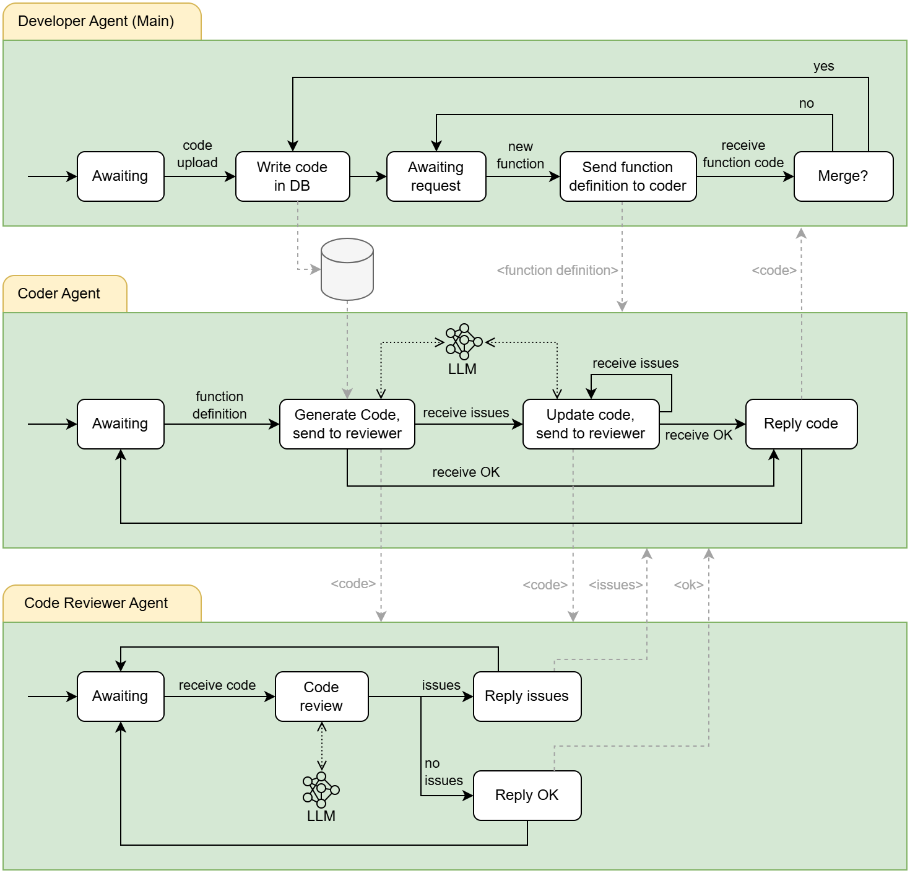

Multi-Agent System
==================

An agent on its own can be smart, but things get really interesting when multiple agents team up.

BAF allows building multi-agent systems where each agent has a specific role, shares information, and works together to get the job done more efficiently.

In this section, we will walk through a **running example** to see how agents interact in action. The system we are looking at is designed to help developers write source code.

This system is composed by 3 agents:

- **Main Agent**: The agent that interacts with the developer, collecting his/her requests. It will store a piece of
  code and will ask for code modifications to a coder agent (in this example, we only considered adding new functions).
- **Coder Agent**: This agent receives coding requests (sent by the main agent) and leverages a specialized LLM to generate
  the requested code. Before replying back the generated code, it is sent to a reviewer agent to check for possible
  errors or bugs. If something was found, the coder agent iterates again to fix the received issues.
- **Code Reviewer Agent**: This agent receives a piece of code and is in charge of finding errors or bugs, leveraging a specialized LLM.

   Multi-Agent System

.. note::

   To enable the communication between agents, they must know their WebSocket URLs, which they will use to send/receive messages.

   Learn how to send messages between agents here: :any:`communication-between-agents`

**Example Workflow:**

1. A developer imports the code of an application into the database.
2. The developer asks the system to generate a function for processing user authentication.
3. The **Main Agent** assigns the request to the **Coder Agent** to generate the function.
4. The **Coder Agent** produces the code.
5. The **Coder Agent** sends the request to the **Reviewer Agent**
6. The **Reviewer Agent** analyzes the code for possible bugs or syntax errors.
7. The **Reviewer Agent** finds a bug and sends it back to the **Coder Agent**.
8. The **Coder Agent** updates the code fixing the received issue.
9. The **Coder Agent** sends the request to the **Reviewer Agent**
10. The **Reviewer Agent** does not find any issue and replies OK.
11. The **Coder Agent** receives the OK and replies the new code to the **Main Agent**.
12. The **Main Agent** updates the code database and awaits for a new developer query.

The following sections show the code implementation for each agent.

Developer Main Agent
--------------------

.. literalinclude:: ../../../besser/agent/test/examples/multiagent/main_agent.py
   :language: python
   :linenos:

Coder Agent
-----------

.. literalinclude:: ../../../besser/agent/test/examples/multiagent/coder_agent.py
   :language: python
   :linenos:

Code Reviewer Agent
-------------------

.. literalinclude:: ../../../besser/agent/test/examples/multiagent/reviewer_agent.py
   :language: python
   :linenos: